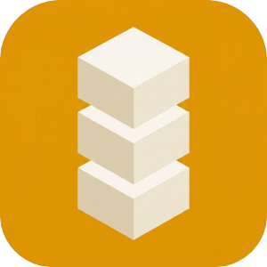

# IDkollen Rust Client

[![Crate][crate-image]][crate-url]
[![Downloads][downloads-image]][downloads-url]
[![Documentation][docs-image]][docs-url]
[![MIT license][license-image]][license-url]

[crate-image]: https://img.shields.io/crates/v/idkollen-client?style=flat-square
[crate-url]: https://crates.io/crates/idkollen-client
[downloads-image]: https://img.shields.io/crates/d/idkollen-client?style=flat-square
[downloads-url]: https://crates.io/crates/idkollen-client
[docs-image]: https://img.shields.io/docsrs/idkollen-client?style=flat-square
[docs-url]: https://docs.rs/idkollen-client
[license-image]: https://img.shields.io/github/license/idkollen/idk-clients?style=flat-square
[license-url]: https://github.com/idkollen/idk-clients/blob/master/LICENSE

API client for the [IDkollen](https://developers.idkollen.se) REST API.

## Features

* **`async`** (default) — async/await via `tokio`
* **`blocking`** - synchronous API via `reqwest::blocking`

## Usage

```toml
[dependencies]
idkollen-client = { version = "0.1", features = ["async"] }
```

```rust
use idkollen_client::{IdkollenClientBuilder, Environment};
use idkollen_client::models::{BankIdSeAuthRequest, PollOptions};

#[tokio::main]
async fn main() -> Result<(), Box<dyn std::error::Error>> {
    let client = IdkollenClientBuilder::new("client_id", "client_secret")
        .environment(Environment::Staging)
        .build()?;

    let session = client
        .bankid_se()
        .auth(BankIdSeAuthRequest::new())
        .await?;

    let result = client
        .bankid_se()
        .wait_for_auth(&session.id(), PollOptions::default())
        .await?;

    println!("{result:#?}");
    Ok(())
}
```

## Development

#### Prerequisites

* [Rust Stable 1.87+](https://rust-lang.org/tools/install/)
* [Cargo](https://doc.rust-lang.org/cargo/getting-started/installation.html)

#### Build

To compile the project, simply issue the following command:

```sh
$ cargo build --all-features
```

#### Test

##### Linting

This project uses [rustfmt](https://github.com/rust-lang/rustfmt) for formatting and 
[clippy](https://github.com/rust-lang/rust-clippy) for linting. Run them with:

```sh
$ cargo fmt --check
$ cargo clippy --all-features
```

##### Unit/Integration/Doc Testing 

All code that goes into main must pass all tests. To run all tests, use:

```sh
$ cargo test --all-features
```
